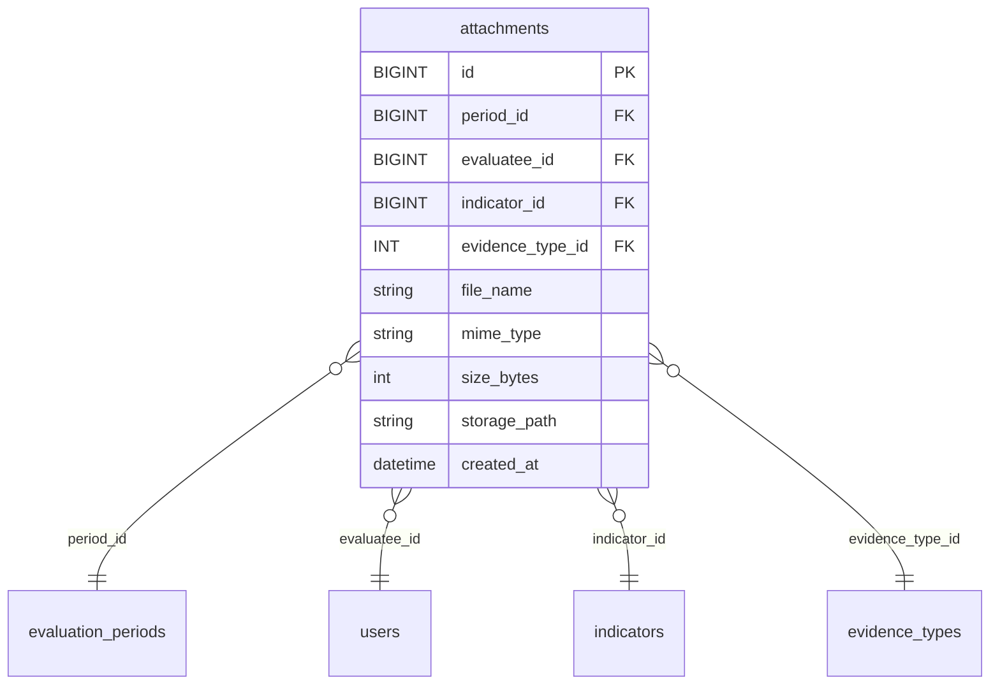

# คู่มือระบบอัปโหลดหลักฐาน (Attachments) — `file.md`

> เวอร์ชัน: 2025-09-12 17:04 UTC  
> ครอบคลุม: โครงสร้าง backend, บทบาท/สิทธิ์, จุดเข้าใช้งาน API, การตั้งค่า Multer, กติกา Validation, การใช้ Postman & Swagger, ตัวอย่างทดสอบ และเช็กลิสต์สำหรับสอน/ตรวจงาน

---

## 1) วัตถุประสงค์ & ขอบเขต
ระบบนี้รองรับ **การอัปโหลด/จัดการไฟล์หลักฐาน** สำหรับการประเมินบุคลากร โดยผูกไฟล์เข้ากับ `period_id` + `evaluatee_id` + `indicator_id` + `evidence_type_id` ตามตาราง `attachments`.  
ออกแบบตามบทบาท **admin / evaluator / evaluatee** พร้อม API สำหรับ **upload / list / update file / update metadata / delete** และนโยบายความปลอดภัย/ความถูกต้องของข้อมูล (integrity).

---

## 2) โครงสร้างโปรเจกต์ (ส่วนที่เกี่ยวข้อง)
```text
backend/
  app.js
  server.js
  .env
  uploads/                     # โฟลเดอร์ไฟล์จริง (เสิร์ฟผ่าน /uploads/*)
  controllers/
    upload.controller.js
  middlewares/
    auth.js
    upload.js                  # Multer (ปลายทาง/ชื่อไฟล์แบบไดนามิก + type/size filter)
  repositories/
    attachments.js
    assignments.js
    indicatorEvidence.js
  routes/
    upload.routes.js
  db/
    knex.js
  openapi_full.json            # สเปก Swagger รวมระบบ
```

> **หมายเหตุ**: `app.js` เป็น “ตัวแอป Express”, `server.js` เป็น “ตัวเปิดพอร์ต (listen)” — แยกกันเพื่อให้ **ทดสอบง่าย** และ **ยืดหยุ่นโพรโทคอล/ดีพลอย**

---

## 3) การตั้งค่าแวดล้อม (.env)
ตัวอย่างคีย์สำคัญ:
```ini
PORT=7000
NODE_ENV=development
JWT_SECRET=changeme
CORS_ORIGIN=http://localhost:5173,http://localhost:3000

# DB (ตัวอย่าง)
DB_CLIENT=mysql2
DB_HOST=127.0.0.1
DB_PORT=3306
DB_USER=root
DB_PASSWORD=12345678
DB_DATABASE=evaluation

# Upload policy
UPLOAD_MAX_MB=20
```

---

## 4) โครงสร้างสคีมาที่เกี่ยวข้อง (สรุป)
- `attachments (id, period_id, evaluatee_id, indicator_id, evidence_type_id, file_name, mime_type, size_bytes, storage_path, created_at)`  
- FK เชื่อม `evaluation_periods`, `users(evaluatee)`, `indicators`, `evidence_types`  
- ดัชนีที่ใช้บ่อย: `(evaluatee_id, period_id)`, และแนะนำเพิ่ม `(period_id, evaluatee_id, indicator_id)`

> **เงื่อนไขสำคัญ**  
> - ต้องมี `assignments(period_id, evaluator_id, evaluatee_id)` รองรับสิทธิ์การเห็น/ประเมิน  
> - ต้องมี mapping ใน `indicator_evidence(indicator_id, evidence_type_id)` เพื่อคุมชนิดไฟล์ที่รับ

---

## 5) นโยบายบทบาท (Policy)
- **Evaluatee**: อัปโหลด/ดู/ลบ/อัปเดตไฟล์ **ของตนเอง** เฉพาะงวดที่เปิด (`evaluation_periods.is_active=1`)
- **Evaluator**: **อ่านเท่านั้น** สำหรับ evaluatee ที่ตนถูกมอบหมายในงวดนั้น
- **Admin**: จัดการได้ทั้งหมด รวม **อัปโหลดแทน** และ **reassign** (เปลี่ยน period/evaluatee/indicator/evidence_type)

> เหตุผล: ปกป้องความสมบูรณ์ของหลักฐาน (ผู้ประเมินไม่ควรแก้ไฟล์ของผู้ถูกประเมิน)

---

## 6) จุดเข้าใช้งาน API (Entry Points)

### 6.1 Evaluatee
- `POST   /api/upload/evidence` — อัปโหลดไฟล์ของตนเอง  
  - `multipart/form-data`: `period_id`, `indicator_id`, `evidence_type_id`, `file`
- `GET    /api/upload/mine?period_id=&indicator_id=` — รายการไฟล์ของตนเอง
- `PUT    /api/upload/:id/file` — แทนที่ไฟล์เดิมของตนเอง
- `PATCH  /api/upload/:id` — อัปเดตเมตาดาต้า `{ indicator_id?, evidence_type_id? }`
- `DELETE /api/upload/:id` — ลบไฟล์ของตนเอง

### 6.2 Evaluator
- `GET    /api/upload/evaluatee/:evaluateeId?period_id=` — ดูไฟล์ของ evaluatee ที่ถูกมอบหมาย (read-only)

### 6.3 Admin
- `POST   /api/upload/admin/evidence` — อัปโหลดแทน evaluatee
- `GET    /api/upload/admin?period_id=&evaluatee_id=&indicator_id=` — ค้นไฟล์
- `PUT    /api/upload/admin/:id/file` — แทนที่ไฟล์ใด ๆ
- `PATCH  /api/upload/admin/:id` — อัปเดตเมตาดาต้า/ย้ายความเป็นเจ้าของ (reassign)
- `DELETE /api/upload/admin/:id` — ลบไฟล์ใด ๆ

> ทั้งหมดใช้ **Bearer JWT** (ดูตัวอย่างใน Postman Environment)

---

## 7) การตรวจสอบก่อนบันทึก (Validation)
1) **สิทธิ์ในงวด**:  
   - Evaluatee อัปโหลด: ต้องมีแถวใน `assignments` ของ `(period_id, evaluatee_id=self)`  
   - Evaluator ดู: ต้องมี `(period_id, evaluator_id=self, evaluatee_id)`
2) **ชนิดไฟล์ตามตัวชี้วัด**:  
   - ตรวจ mapping ใน `indicator_evidence (indicator_id, evidence_type_id)`
3) **ขนาด/ประเภทไฟล์**:  
   - ตรวจด้วย Multer + นโยบายในโค้ด (mimetype whitelist, `UPLOAD_MAX_MB`)
4) **งวดเปิด (optional but recommended)**:  
   - ปฏิเสธการแก้ไข/อัปโหลด เมื่อ `evaluation_periods.is_active = 0`

---

## 8) การจัดเก็บไฟล์ (Multer)
- โฟลเดอร์จริง: `backend/uploads/{period_id}/{evaluatee_id}/`
- ชื่อไฟล์: `{timestamp}_{safeName}.{ext}`  
- URL เข้าถึง: `/uploads/{period_id}/{evaluatee_id}/{filename}` (เพราะ `app.use('/uploads', express.static(...))` แล้ว)

ตัวอย่าง filter (ย่อ):
```js
const ALLOWED = new Set(['application/pdf','image/png','image/jpeg','image/webp', /* ... */ ]);
if (!ALLOWED.has(file.mimetype)) cb(new Error('Unsupported file type'), false);
```

---

## 9) ตัวอย่างการใช้งาน (cURL)
### Evaluatee: อัปโหลดไฟล์
```bash
curl -X POST "{{baseUrl}}/api/upload/evidence"   -H "Authorization: Bearer <TOKEN_EVALUATEE>"   -F "period_id=1001"   -F "indicator_id=23"   -F "evidence_type_id=1"   -F "file=@lesson_plan.pdf"
```

### Evaluator: ดูไฟล์ของผู้ถูกประเมิน
```bash
curl "{{baseUrl}}/api/upload/evaluatee/55?period_id=1001"   -H "Authorization: Bearer <TOKEN_EVALUATOR>"
```

### Admin: ย้ายไฟล์ไปยังตัวชี้วัด/งวดใหม่ (reassign meta)
```bash
curl -X PATCH "{{baseUrl}}/api/upload/admin/123"   -H "Authorization: Bearer <TOKEN_ADMIN>"   -H "Content-Type: application/json"   -d '{"period_id":1002,"evaluatee_id":55,"indicator_id":31,"evidence_type_id":2}'
```

---

## 10) การใช้ Postman & Swagger
- **Postman**: ใช้ไฟล์  
  - `A5_Upload_Env.postman_environment.json` (ตั้ง token และตัวแปร)  
  - `A5_Upload_API.postman_collection.json` (คำสั่งแยกตามบทบาท)  
- **Swagger**: ใช้ `openapi_full.json` แล้วเปิดที่ `/docs`  
  - ใน `app.js`:
    ```js
    const openapi = JSON.parse(fs.readFileSync(path.join(__dirname, 'openapi_full.json'), 'utf-8'));
    app.get('/openapi.json', (req,res)=> res.json(openapi));
    app.use('/docs', swaggerUi.serve, swaggerUi.setup(openapi));
    ```

---

## 11) ตัวอย่างเทสต์ (Supertest)
> จุดเด่นของการแยก `app.js` ออกจาก `server.js`: ทดสอบได้โดย **ไม่ต้องเปิดพอร์ต**

```js
// tests/upload.e2e.test.js
const request = require('supertest');
const app = require('../app');

describe('GET /health', () => {
  it('should be ok', async () => {
    const res = await request(app).get('/health');
    expect(res.statusCode).toBe(200);
  });
});
```

> สำหรับ multipart ทดสอบด้วย `attach()` และ mock JWT ใน header

---

## 12) ข้อควรระวัง & ความปลอดภัย
- สแกน/จำกัดไฟล์ (mimetype/ขนาด) เพื่อกันมัลแวร์
- ตั้งสิทธิ์โฟลเดอร์ `uploads` ให้ไม่รันสคริปต์ (เช่น ปิด execution บน Nginx)
- Log การอัปโหลด/ลบ (audit) — เก็บ `user_id, ip, ua, action, timestamp`
- สำรองไฟล์ & เก็บแยก Storage (เช่น S3 หรือ NFS) ใน production
- ใช้ HTTPS ในการรับส่ง

---

## 13) เช็กลิสต์สำหรับสอน/ตรวจงานนักศึกษา
- [ ] กำหนด `evaluation_periods` และตั้ง `is_active=1` สำหรับงวดปัจจุบัน
- [ ] ใส่ `evaluation_topics` / `indicators` + mapping `indicator_evidence`
- [ ] สร้าง `assignments` ครบทุกคู่ evaluator↔evaluatee
- [ ] ทดสอบ Evaluatee: upload → list → patch meta → put file → delete
- [ ] ทดสอบ Evaluator: list (เฉพาะที่มอบหมาย)
- [ ] ทดสอบ Admin: upload on-behalf → list → patch (reassign) → put file → delete
- [ ] ตรวจ URL ไฟล์ใน `/uploads/...` เข้าถึงได้จริง
- [ ] ตรวจ Swagger `/docs` และ Postman collection ยิงได้ครบ

---

## 14) ภาคผนวก
### 14.1 ER (ย่อ — Mermaid)


### 14.2 โค้ดสั้นสำหรับ `module.exports = app;`
```js
// app.js
const express = require('express');
const app = express();
// ... ตั้งค่า middleware/routes/error handler ...
module.exports = app; // ส่งออก "ตัวแอป" เพื่อใช้ใน server.js และการทดสอบ
```

---

## 15) ประวัติการเปลี่ยนแปลง (Changelog - stub)
- 1.0.0 — สร้างคู่มือเบื้องต้น ครอบคลุม endpoint อัปโหลดและบทบาทครบ
