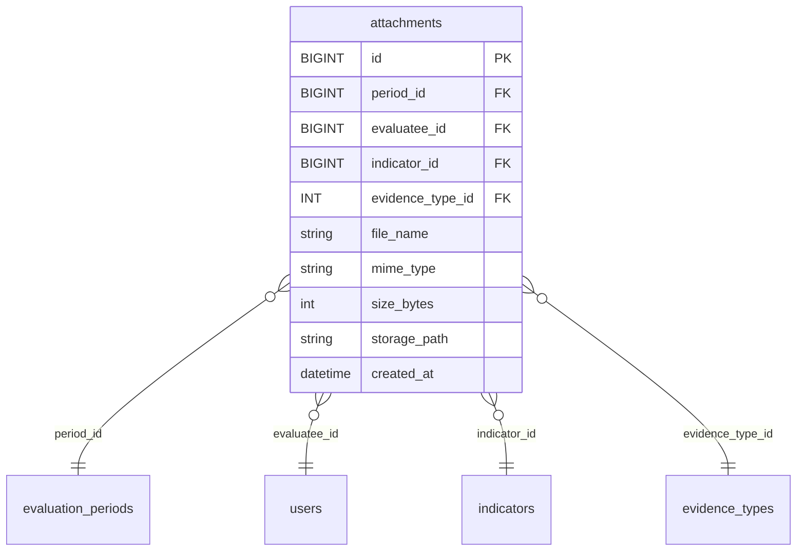
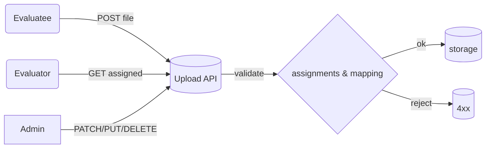

# ภาคผนวก

## สคีมาและดัชนี (ย่อ)
- `attachments(id, period_id, evaluatee_id, indicator_id, evidence_type_id, file_name, mime_type, size_bytes, storage_path, created_at)`  
- ดัชนีแนะนำ: `(evaluatee_id, period_id)`, `(period_id, evaluatee_id, indicator_id)`

## ER (Mermaid)


## Flow (Mermaid)


## ตัวอย่าง `.env` keys
```ini
PORT=7000
NODE_ENV=development
JWT_SECRET=changeme
CORS_ORIGIN=http://localhost:5173,http://localhost:3000

DB_CLIENT=mysql2
DB_HOST=127.0.0.1
DB_PORT=3306
DB_USER=root
DB_PASSWORD=12345678
DB_DATABASE=evaluation

UPLOAD_MAX_MB=20
```

## ตัวอย่าง `app.js` (export app)
```js
const express = require('express');
const fs = require('fs'); const path = require('path');
const swaggerUi = require('swagger-ui-express');
const app = express();
app.use(express.json());

// routes...
app.get('/health', (req,res)=> res.json({ok:true}));

// swagger
const openapi = JSON.parse(fs.readFileSync(path.join(__dirname, 'openapi_full.json'),'utf-8'));
app.get('/openapi.json', (req,res)=> res.json(openapi));
app.use('/docs', swaggerUi.serve, swaggerUi.setup(openapi));

module.exports = app;
```

## ตัวอย่าง `server.js`
```js
const http = require('http');
const app = require('./app');
const PORT = process.env.PORT || 7000;
http.createServer(app).listen(PORT, ()=> console.log('Listening on', PORT));
```

## ตัวอย่าง `middlewares/upload.js` (ย่อ)
```js
const multer = require('multer');
const path = require('path'); const fs = require('fs');

const MAX_MB = parseInt(process.env.UPLOAD_MAX_MB || '20', 10) * 1024 * 1024;
const ALLOWED = new Set(['application/pdf','image/png','image/jpeg','image/webp']);

const storage = multer.diskStorage({
  destination: (req, file, cb)=>{
    const { period_id, evaluatee_id } = req.body;
    const dir = path.join(__dirname, '..','uploads', String(period_id), String(evaluatee_id));
    fs.mkdirSync(dir, { recursive: true });
    cb(null, dir);
  },
  filename: (req, file, cb)=>{
    const safe = path.parse(file.originalname).name.replace(/[^a-zA-Z0-9_-]/g,'_');
    const ext = path.extname(file.originalname).toLowerCase();
    cb(null, `${Date.now()}_${safe}${ext}`);
  }
});

function fileFilter(req, file, cb){
  if(!ALLOWED.has(file.mimetype)) return cb(new Error('Unsupported file type'), false);
  cb(null, true);
}

module.exports = multer({ storage, fileFilter, limits: { fileSize: MAX_MB } });
```

## Pandoc (ออก DOCX/PDF)
```bash
# DOCX (ใช้เทมเพลตไทย template_th.docx)
pandoc docs/index.md docs/api.md docs/security.md docs/testing.md docs/appendix.md \
  -o A5_Upload_Guide.docx --reference-doc=template_th.docx

# PDF (XeLaTeX + ฟอนต์ไทย)
pandoc docs/index.md docs/api.md docs/security.md docs/testing.md docs/appendix.md \
  -o A5_Upload_Guide.pdf --pdf-engine=xelatex \
  -V mainfont="TH Sarabun New" -V fontsize=12pt -V geometry:margin=1in
```